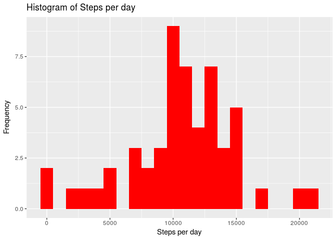
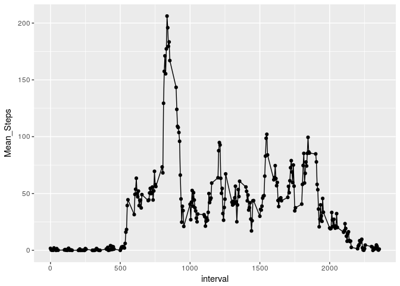
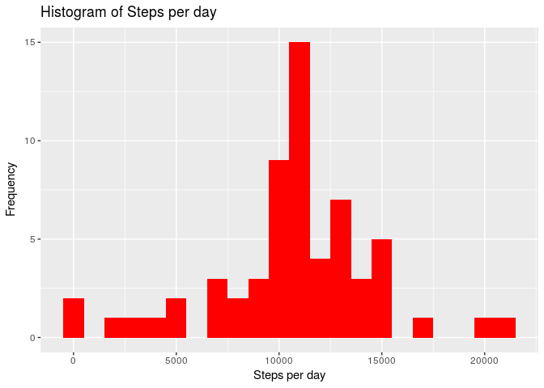
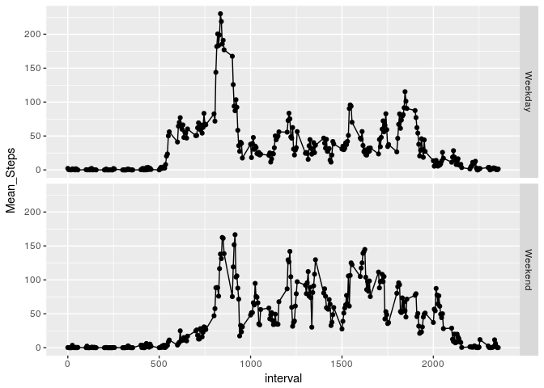

# Reproducible Research: Peer Assessment 1
D Pond  
24 November 2017  


## Introduction

It is now possible to collect a large amount of data about personal movement using activity monitoring devices such as a Fitbit, Nike Fuelband, or Jawbone Up. These type of devices are part of the "quantified self" movement - a group of enthusiasts who take measurements about themselves regularly to improve their health, to find patterns in their behavior, or because they are tech geeks. But these data remain under-utilized both because the raw data are hard to obtain and there is a lack of statistical methods and software for processing and interpreting the data.

This assignment makes use of data from a personal activity monitoring device. This device collects data at 5 minute intervals through out the day. The data consists of two months of data from an anonymous individual collected during the months of October and November, 2012 and include the number of steps taken in 5 minute intervals each day.

## Requirements

1. What is mean total number of steps taken per day?
2. What is the average daily activity pattern?
3. Imputing missing values. Are there differences?
4. Are there differences in activity patterns between weekdays and weekends?

## Answers

Load packages and dataset:


```r
library(dplyr)
library(ggplot2)

dataset <- read.csv("activity.csv", stringsAsFactors = FALSE)
```

### 1.)


```r
byDay <- group_by(dataset, date)
sumByDay <- summarise(byDay, Total_Steps = sum(steps))


g <- ggplot(sumByDay, aes(x = Total_Steps)) + geom_histogram(fill = "red", binwidth = 1000) +
  labs(title = "Histogram of Steps per day", x = "Steps per day", y = "Frequency")
g
```

<!-- -->

```r
medianSteps <- median(sumByDay$Total_Steps, na.rm = TRUE)
meanSteps <- round(mean(sumByDay$Total_Steps, na.rm = TRUE), 2)

cat(paste("Mean steps taken per day: ", meanSteps))
```

Mean steps taken per day:  10766.19

```r
cat(paste("Median steps taken per day: ", medianSteps))
```

Median steps taken per day:  10765

### 2.)


```r
byInterval <- group_by(dataset, interval)
avStepsByInterval <- summarise(byInterval, Mean_Steps = mean(steps, na.rm = TRUE))

g <- ggplot(avStepsByInterval, aes(x = interval, y = Mean_Steps)) + geom_point() + geom_line()
g
```

<!-- -->

```r
maxInterval <- avStepsByInterval[which.max(avStepsByInterval$Mean_Steps),]
cat(paste("Interval with maximum steps was ", maxInterval[1], " with ", round(maxInterval[2],0), " steps."))
```

Interval with maximum steps was  835  with  206  steps.

### 3.)


```r
noNA <- sum(is.na(dataset$steps))
cat(paste("Number of NAs: ", noNA))
```

Number of NAs:  2304

```r
newValue <- function(dataset, day, interval)
{
  meanByDay <- mean(dataset$steps[dataset$date == day], na.rm = TRUE)
  meanByInt <- mean(dataset$steps[dataset$interval == interval], na.rm = TRUE)
  
  round(mean(c(meanByDay, meanByInt), na.rm = TRUE), 0)
}

newSteps = numeric()
for(i in 1:length(dataset$steps))
{
  if(is.na(dataset$steps[i]))
  {
    newSteps <- c(newSteps,newValue(dataset, dataset$date[i], dataset$interval[i]))
  }
  else
  {
    newSteps <- c(newSteps,dataset$steps[i])
  }
}

newDataset <- dataset
newDataset$steps <- newSteps

byDay <- group_by(newDataset, date)
sumByDay <- summarise(byDay, Total_Steps = sum(steps))


g <- ggplot(sumByDay, aes(x = Total_Steps)) + geom_histogram(fill = "red", binwidth = 1000) +
  labs(title = "Histogram of Steps per day", x = "Steps per day", y = "Frequency")
g
```

<!-- -->

```r
newMedianSteps <- median(sumByDay$Total_Steps, na.rm = TRUE)
newMeanSteps <- round(mean(sumByDay$Total_Steps, na.rm = TRUE), 2)

cat(paste("Mean steps taken per day with imputed data points: ", newMeanSteps))
```

Mean steps taken per day with imputed data points:  10765.64

```r
cat(paste("Median steps taken per day imputed data points: ", newMedianSteps))
```

Median steps taken per day imputed data points:  10762

In the above code, the function newSteps calculates the mean number of steps in that interval and the mean number of steps on that day, and takes the average of those two numbers as the imputed value. As can be seen, imputing data has very little effect of the mean and median values of the distribution, with the mean changing from 10766 to 10766 and the median changing from 10765 to 10762. Imputing with the mthod devised adds the majority of new points around the middle of the distribution. This creates a central spike. As the data was originally fairly normal, it makes sense that the median and mean values wouldn't change much by adding points around the middle. The variance may be a better tell of how imputing values has influenced the distribution.

### 4.)


```r
partOfWeek <- sapply(as.Date(newDataset$date), function(x) {if(weekdays(x) %in% c("Monday", "Tuesday", "Wednesday", "Thursday", "Friday")){"Weekday"} else {"Weekend"}})
newDataset$partOfWeek <- as.factor(partOfWeek)

byWeekAndInterval <- group_by(newDataset, partOfWeek,interval)
avStepsByInterval <- summarise(byWeekAndInterval, Mean_Steps = mean(steps, na.rm = TRUE))

g <- ggplot(avStepsByInterval, aes(x = interval, y = Mean_Steps)) + geom_point() + geom_line() + facet_grid(partOfWeek ~ .)
g
```

<!-- -->
